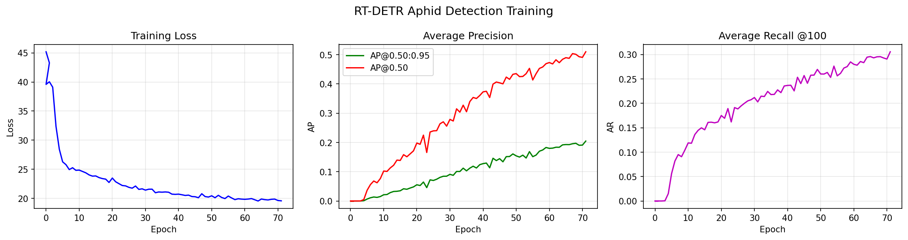

# Aphid Detection with RT-DETR

Object detection pipeline for aphid detection using [RT-DETR](https://github.com/lyuwenyu/RT-DETR) (Real-Time Detection Transformer).

## Project Structure

```
rtdetr/
├── RT-DETR/                  # RT-DETR framework (rtdetr_pytorch, rtdetrv2_pytorch)
├── aphids_ivan/              # Dataset preparation and training scripts
│   ├── dataset/              # Processed dataset (COCO format annotations)
│   ├── check_json.py         # Validate COCO annotation JSON
│   ├── dim.py                # Check image dimensions
│   ├── down.py               # Dataset download utility
│   ├── plot.py               # Plot training metrics
│   └── poly_bb.py            # Convert polygon annotations to bounding boxes
└── training_metrics.png      # Training loss / mAP curves
```

## Setup

```bash
# Create and activate virtual environment
python -m venv venv_rtdetr
# Windows
venv_rtdetr\Scripts\activate

# Install dependencies
pip install -r RT-DETR/rtdetrv2_pytorch/requirements.txt
```

## Training

```bash
cd RT-DETR/rtdetrv2_pytorch
python tools/train.py -c configs/rtdetrv2/rtdetrv2_r50vd_6x_coco.yml \
    --use-amp --seed=0
```

## Dataset

The aphid dataset uses COCO-format annotations. Images and annotation files should be placed under `aphids_ivan/dataset/` following the structure expected by the RT-DETR dataloader.

## Results


